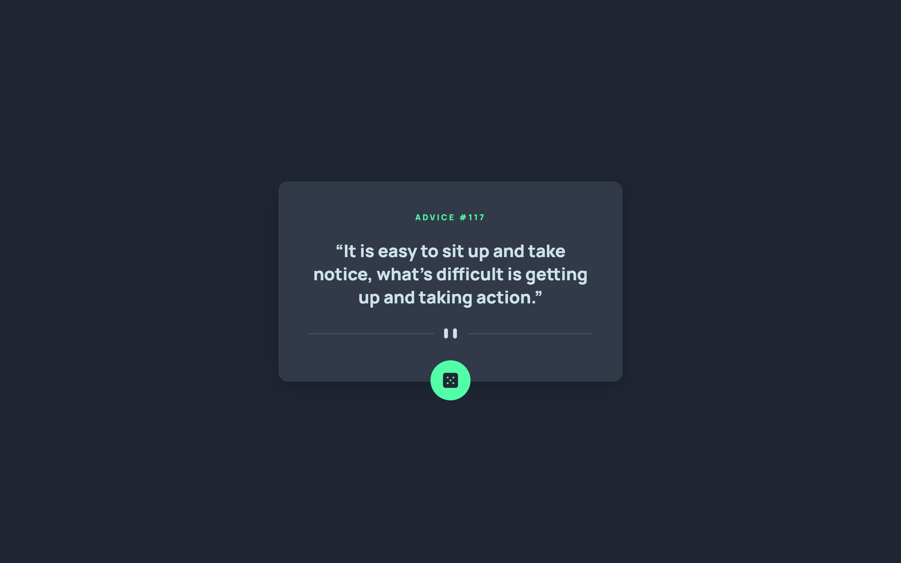

# Frontend Mentor - Advice generator app solution

This is a solution to the [Advice generator app challenge on Frontend Mentor](https://www.frontendmentor.io/challenges/advice-generator-app-QdUG-13db). Frontend Mentor challenges help you improve your coding skills by building realistic projects.

## Table of contents

- [Overview](#overview)
  - [The challenge](#the-challenge)
  - [Screenshot](#screenshot)
  - [Links](#links)
- [My process](#my-process)
  - [Built with](#built-with)
  - [What I learned](#what-i-learned)
  - [Useful resources](#useful-resources)
- [Author](#author)

## Overview

### The challenge

Users should be able to:

- View the optimal layout for the app depending on their device's screen size
- See hover states for all interactive elements on the page
- Generate a new piece of advice by clicking the dice icon

### Screenshot

### Links

- Live Site URL: [Sasha Herman | Advice Generator | Vercel](https://advice-generator-app-main-nine.vercel.app)

## My process

### Built with

- Semantic HTML5 markup
- CSS custom properties
- Flexbox
- Mobile-first workflow
- JavaScript

### What I learned

The most challenging part of this project was integrating the API as my knowledge on the fetch() API and async is still quite limited and fresh. Coming from my previous project, [Expenses Chart Calculator](https://expenses-chart-component-sage.vercel.app), which made use of API integration as well, I was on a better platform with regards to what methods to use and research.

### Useful resources

- [MDN Docs | Using the Fetch API](https://developer.mozilla.org/en-US/docs/Web/API/Fetch_API/Using_Fetch) - This helped to introduce me into the format of the fetch API.
- [Web Dev Simplified | Learn Fetch API In 6 Minutes](https://www.youtube.com/watch?v=cuEtnrL9-H0) - This video helped to break down each piece of the fetch API which I was introduced to in the previous resource.
- [JavaScript Tutorial | JavaScript fetch API](https://www.javascripttutorial.net/javascript-fetch-api/) - This article is what explained the async method which I used in the finished product to retrieve the data from the API.

## Author

- Frontend Mentor - [@SashaH62](https://www.frontendmentor.io/profile/SashaH62)
